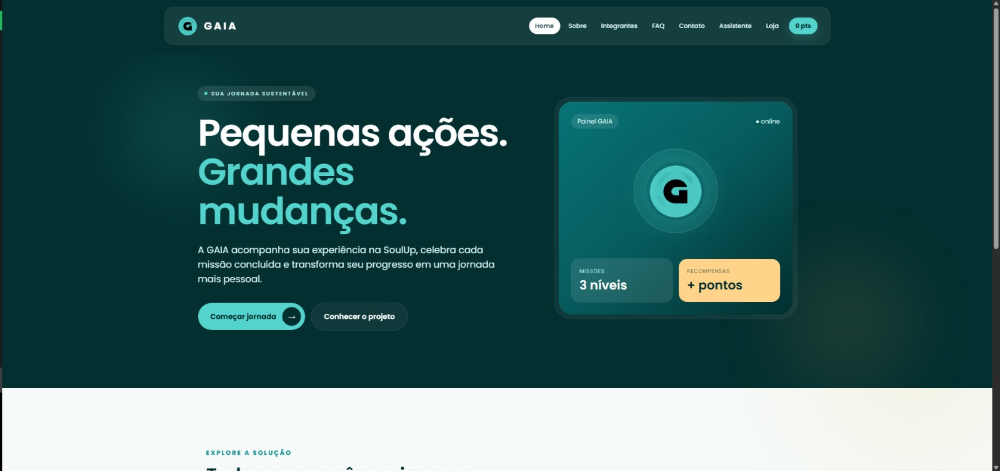
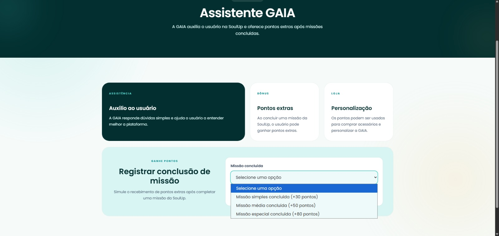
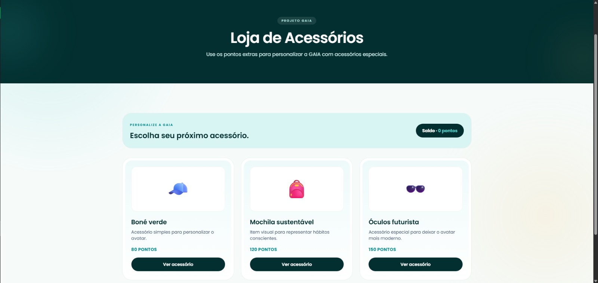
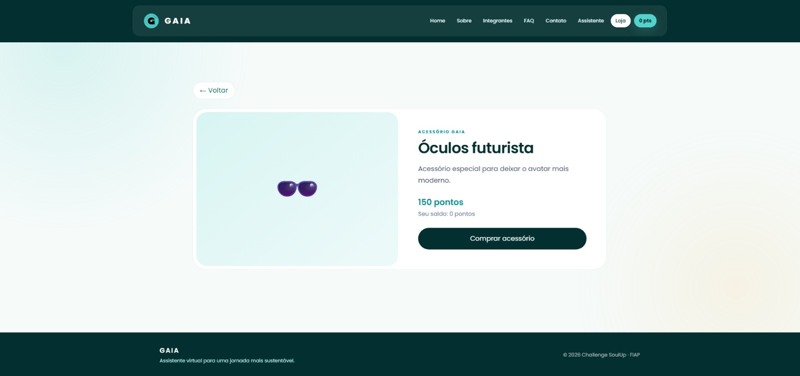

# GAIA — Assistente Virtual para a SoulUp


## Descrição do projeto

O **GAIA** é um projeto acadêmico desenvolvido para o **Challenge SoulUp da FIAP**. A solução apresenta uma assistente virtual em formato de avatar que orienta os usuários dentro da plataforma SoulUp, incentiva a conclusão de missões sustentáveis e oferece pontos extras.

Os pontos recebidos podem ser utilizados em uma loja de acessórios para personalizar a GAIA. Nesta Sprint 4, o projeto original foi migrado para uma aplicação **SPA** (*Single Page Application*) com React, Vite e TypeScript.

O projeto GAIA atende ao **Desafio 3 – Avatar Inteligente e Interativo**, buscando aumentar o engajamento dos usuários da SoulUp por meio de orientações personalizadas, acompanhamento de missões, notificações e interações adaptadas ao perfil do usuário.

A solução combina **inteligência, gamificação e personalização** e possui integração com a API presente no projeto. Embora os dados locais sejam utilizados como apoio durante a avaliação da interface, a aplicação está preparada para consumir os serviços da API Java. O usuário pode receber pontos extras ao concluir missões e interações e utilizá-los para adquirir acessórios para personalizar a GAIA.

## Funcionalidades

- Navegação SPA entre todas as páginas;
- Registro da conclusão de missões;
- Saldo de pontos compartilhado entre as páginas;
- Loja de acessórios;
- Página dinâmica de detalhes de cada acessório;
- Validação do formulário de contato;
- Página de integrantes;
- Layout responsivo para celulares e computadores;
- Página personalizada para endereços não encontrados.

## Imagens do projeto

As imagens abaixo são exemplos de caminhos esperados para os arquivos visuais do projeto. Adicione os arquivos correspondentes na pasta `public/images/` para que sejam exibidos no GitHub.

### Tela inicial



Na página inicial, foram acrescentados cartões interativos que facilitam a navegação entre as principais áreas do site, como Sobre, Assistente, Loja, Integrantes e FAQ.

### Assistente e missões



Integrada à API Java, permite visualizar e concluir missões sustentáveis para ganhar pontos.

### Loja de acessórios



Permite utilizar os pontos acumulados para adquirir acessórios e personalizar a GAIA.

### Detalhes de um acessório



### Responsividade


Projeto com responsividade


## Tecnologias utilizadas

- React;
- TypeScript;
- Vite;
- Tailwind CSS;
- React Router DOM;
- React Hook Form;
- Git e GitHub.

## Como usar

### Pré-requisitos

- Node.js instalado;
- npm instalado.

### Instalação

```bash
npm install
```

### Execução em ambiente de desenvolvimento

```bash
npm run dev
```

Abra o endereço exibido no terminal, normalmente [`http://localhost:5173`](http://localhost:5173).

### Verificação do projeto

```bash
npm run lint
npm run build
```

## Rotas

| Rota | Página |
| --- | --- |
| `/` | Home |
| `/sobre` | Sobre o projeto |
| `/integrantes` | Integrantes |
| `/faq` | Perguntas frequentes |
| `/contato` | Contato |
| `/assistente` | Assistente e missões |
| `/loja` | Loja de acessórios |
| `/loja/:id` | Detalhes de um acessório |

## Estrutura de pastas

```text
public/
└── images/              # Imagens e screenshots usados na aplicação e no README

src/
├── components/          # Componentes reutilizáveis
├── context/             # Estado compartilhado de pontos
├── data/                # Dados temporários de missões e acessórios
├── pages/               # Páginas da aplicação
├── types/               # Interfaces TypeScript
├── App.tsx              # Rotas da aplicação
├── index.css            # Tailwind CSS e tema visual
└── main.tsx             # Entrada do React
```

## Integração com a API

A integração será realizada com a API Java desenvolvida na disciplina de **Domain Driven Design Using Java**. Enquanto o contrato da API não estiver disponível, missões, acessórios e pontos funcionam localmente para permitir a navegação e a avaliação da interface.


## Integrantes e créditos

### Henrique da Silva Muniz

- **RM:** 573874
- **Turma:** 1TDSPv-2026
- **GitHub:** [henriquemunizz](https://github.com/henriquemunizz)
- **LinkedIn:** [Henrique Muniz](https://www.linkedin.com/in/henrique-muniz-044b05365)

### Erick Keiji Miyashiro

- **RM:** 568966
- **Turma:** 1TDSPv-2026
- **GitHub:** [Perfil no GitHub](https://share.google/xpS9gpDfEr3WzYZaw)
- **LinkedIn:** [Erick Keiji Miyashiro](https://www.linkedin.com/in/erick-keiji-miyashiro-6228b93b4)

### Yuto Inoue

- **RM:** 573161
- **Turma:** 1TDSPv-2026
- **GitHub:** [yutoinouee](https://github.com/yutoinouee)
- **LinkedIn:** [Yuto Inoue](https://www.linkedin.com/in/yuto-inoue-713348373?utm_source=share_via&utm_content=profile&utm_medium=member_ios)

### Gustavo Costa

- **RM:** 573074
- **Turma:** 1TDSPv-2026
- **GitHub:** [gcosta900](https://github.com/gcosta900)
- **LinkedIn:** [Gustavo Costa Moreira](https://www.linkedin.com/in/gustavocostamoreira)

## Links da entrega

- **Repositório GitHub:** [GAIA-React](https://github.com/henriquemunizz/GAIA-React)
- **Aplicação publicada na Vercel:** [Acessar aplicação](COLE_AQUI_O_LINK_DA_VERCEL)
- **API Java publicada:**  [Acessar API] https://gaia-api-sprint-4.vercel.app/
- **Vídeo de apresentação no YouTube:** [Assistir ao vídeo](COLE_AQUI_O_LINK_DO_YOUTUBE)

## Contato

henriquedasilvamuniz03@gmail.com ou rm573874@fiap.com.br ou 11985963197

erickmiyashiro@gmail.com ou rm568966@fiap.com.br ou 11 947970626

guzta.costa@gmail.com ou rm573074@fiap.com.br ou 11913112522

rm568952@fiap.com.br ou 11947289435

## Observação

A Sprint 4 estava aparecendo no lugar da Sprint 3 na plataforma. Por isso, seguimos suas orientações e realizamos a integração com a API Java. Só percebemos a divergência depois que o trabalho já estava concluído, motivo pelo qual não informamos o professor antes.